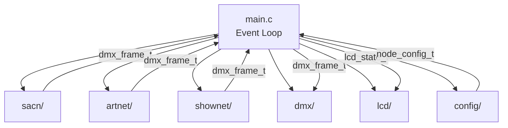

# Firmware Architecture

The sn110dmx firmware is a single-threaded daemon that runs on uClinux (Linux
2.0.38) on the NS7520's ARM7TDMI core. It replaces the factory `lxnetdmx`
daemon with an sACN (E1.31) DMX gateway.

## Design Constraints

These constraints come from the hardware and OS, not design preference:

| Constraint | Reason |
|-----------|--------|
| **Single-threaded** | `clone()` is unstable on this kernel. The daemon uses a polling event loop. |
| **No standard libc** | uClinux 2.0 has no usable libc. All C library functions come from `src/oabi/minilib.c`. |
| **No dynamic memory** | No `malloc`/`free`. Everything is statically allocated or on the stack. |
| **OABI syscalls** | Linux 2.0 ARM uses `swi 0x900000 + NR` for syscalls, not the modern EABI convention. |
| **bFLT v2 binary format** | No ELF support. PIC via GOT with `sl` (r10) as the GOT base register. |
| **~450 KB flash budget** | Binary must fit in the device's flash. A typical build is ~26 KB. |

## Event Loop

The main loop in `src/main.c` runs at approximately 1-second intervals:

```
while (running) {
    1. Poll protocol sockets (sACN/Art-Net/ShowNet) with select()
    2. Process incoming packets → update DMX frame buffers
    3. Write DMX output frames to TX ports (open-write-close per frame)
    4. Read DMX input from RX ports → feed to protocol TX
    5. Check source timeouts → enter hold mode or zero output
    6. Populate LCD state snapshot from current state
    7. Call lcd_update() to refresh the display
    8. Sleep remainder of tick interval
}
```

## Module Communication

Modules communicate through well-defined interfaces, not shared global state.
The main loop acts as the orchestrator:



The key data types flowing between modules:

| Type | Defined in | Purpose |
|------|-----------|---------|
| `node_config_t` | `common.h` | Global node configuration (hostname, IP, ports, protocol) |
| `dmx_frame_t` | `common.h` | DMX frame buffer (512 channels + metadata) |
| `lcd_state_t` | `lcd/lcd.h` | Display state snapshot (network, port status) |
| `port_config_t` | `common.h` | Per-port configuration (mode, universe, protocol) |

## Build System

The firmware uses a Docker-based cross-compilation pipeline:

```
Source (.c/.S) --> arm-linux-gnueabi-gcc (PIC) --> ARM ELF
ARM ELF --> tools/elf2bflt.py --> bFLT v2 binary
```

Key build flags:

- `-fpic` -- Position Independent Code (required for bFLT relocation)
- `-Os` -- Optimize for size (flash budget)
- `-nostdlib -nostartfiles` -- No standard libraries, custom startup
- `-Wall -Wextra` -- All warnings enabled

The `#ifndef HOST_BUILD` guard allows device-only code (ioctls, `/dev/` access,
LCD hardware, network detection) to be excluded when building the test suite on
the host.

## Protocol Selection

The active protocol is set in the configuration. Only one protocol is active at
a time:

| Protocol | Module | Transport | Port |
|----------|--------|-----------|------|
| sACN (E1.31) | `sacn/` | UDP multicast | 5568 |
| Art-Net | `artnet/` | UDP broadcast/unicast | 6454 |
| ShowNet | `shownet/` | UDP broadcast | 2501 |

Each protocol module provides the same interface pattern: `init()`, socket
polling via `select()`, and frame extraction into `dmx_frame_t`.
