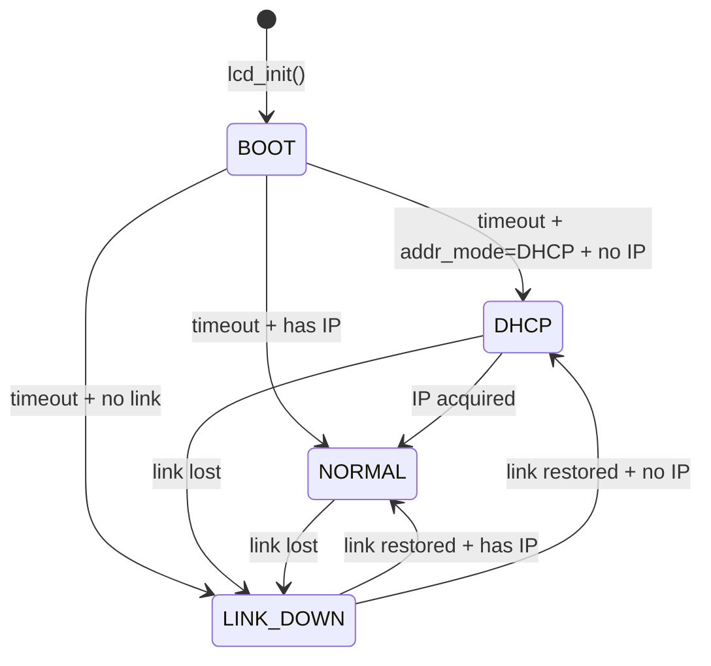

# LCD Module

The LCD module (`src/lcd/`) drives the SN110's 96x32 pixel display. It is split
into two layers: display logic (`lcd.c`) and hardware access (`lcd_hw.c`).

## Architecture

```
main.c                    lcd.c                     lcd_hw.c
  |                         |                          |
  | lcd_state_t snapshot    | Format 4 lines of text   | ioctl cmd 7
  +------------------------>| Mode selection           | Change detection
                            | Carousel timer           | /dev/lcd0
                            +------------------------->|
```

The main loop populates an `lcd_state_t` snapshot each tick and passes it to
`lcd_update()`. The LCD module owns no network or DMX state -- it only reads
the snapshot.

## Display Modes

The display operates in one of four context-aware modes:

### BOOT

Shown for the first few seconds after startup.

```
+----------------+
|   sn110dmx     |
|   v0.3.0       |
|   Open-source  |
|   DMX gateway  |
+----------------+
```

### DHCP

Shown while waiting for DHCP lease assignment (`addr_mode` is DHCP or
DHCP+Static, and no IP assigned yet).

```
+----------------+
|SN110      DHCP.|  <- dots animate
|00E001:00ECFD   |  <- MAC address
|                |
|                |
+----------------+
```

### NORMAL

Primary operating mode. Shows hostname, IP/MAC carousel, and per-port status.

```
+----------------+
|SN110           |  <- hostname (Line 1)
|192.168.  2.231 |  <- IP address (Line 2, alternates with MAC)
|u001 TX  LIVE   |  <- Port 0 status (Line 3)
|u002 RX  LIVE   |  <- Port 1 status (Line 4)
+----------------+
```

**Line 2 carousel**: Alternates between IP address and MAC address every few
seconds.

**Port status values**:

| State | Display | Meaning |
|-------|---------|---------|
| LIVE | `LIVE` | Actively receiving/transmitting data |
| HOLD | `HOLD nn` | Source lost, holding last values (countdown in seconds) |
| IDLE | `IDLE` | No data, no hold active |
| OFF | `OFF` | Port disabled in configuration |

### LINK_DOWN

Same layout as NORMAL, but Line 2 shows "LINK DOWN" instead of the IP/MAC
carousel. Triggered when Ethernet link is not detected.

```
+----------------+
|SN110           |
|  LINK DOWN     |
|u001 TX  IDLE   |
|u002 RX  IDLE   |
+----------------+
```

## Mode Transitions



## Line Change Detection

The hardware layer (`lcd_hw.c`) maintains a cache of previously written lines.
Before sending an ioctl to the LCD device, it compares the new line content
against the cache using `memcmp()`. If the line hasn't changed, the write is
skipped entirely.

This avoids 3-4 unnecessary open-ioctl-close cycles per tick in steady state,
since most display lines don't change every second.

## Hardware Interface

The hardware layer uses ioctl cmd 7 (`0x40306C07`) for all line updates. Each
write follows the open-ioctl-close pattern:

```c
int fd = open("/dev/lcd0", O_RDWR, 0);
ioctl(fd, LCD_CMD7, buf);  /* 48-byte buffer: col, row, text */
close(fd);
```

For details on the LCD hardware interface, see
[LCD Display](../hardware/lcd-display.md).

## Key Types

### lcd_state_t

```c
typedef struct {
    char     hostname[16];
    uint32_t ip_addr;           /* host byte order, 0 = unassigned */
    uint8_t  mac[6];
    uint8_t  addr_mode;         /* ADDR_MODE_* */
    int      link_up;           /* 1 = Ethernet link active */

    struct {
        int      mode;          /* DMX_MODE_OFF / TX / RX */
        uint16_t universe;      /* 1-based */
        int      live;          /* 1 = actively sending/receiving */
        int      held;          /* 1 = source lost, holding values */
        uint32_t hold_remaining_ms;
    } port[LCD_PORT_COUNT];
} lcd_state_t;
```

### Public API

| Function | Purpose |
|----------|---------|
| `lcd_init(contrast, backlight)` | Clear display, set contrast/backlight, show boot splash |
| `lcd_update(state)` | Update display based on state snapshot (call once per second) |
| `lcd_shutdown()` | Clear screen and turn off backlight |
